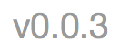
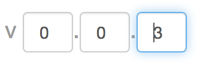

AngularJS Programming Task
===========

In order to be considered for the AngularJS position, you must complete the following steps. 

*Note: This task should take no longer than 1-2 hours at the most.*

### Prerequisites

- Please note that this will require some basic [JavaScript](http://www.codecademy.com/tracks/javascript) and [AngularJS](http://angularjs.com/) knowledge. [Egghead.io](http://www.egghead.io/) is an excellent source for AngularJS knowledge.

You will need to have the following installed to complete this task:
- [NodeJS](http://www.nodejs.org/)
- [Karma](http://karma-runner.github.io/)

## Task

1. Fork this repository (if you don't know how to do that, Google is your friend)
2. Create a *source* folder to contain your code. 
3. In the *source* directory, please create an Angular app that does the following:
	- Create a directive to modify a [semantic version number](http://semver.org/) (MAJOR.MINOR.REVISION)
	- The directive should use ngModel for two-way data binding to a variable on the scope (a string, eg "1.2.3"
	- The directive should start by displaying the semantic version as text (read-only mode: )
	- When clicked, the directive should display text fields to allow modifying the major, minor, and revision numbers individually (edit mode: )
	- When the user clicks outside the control, it should revert to the read-only display
4. Commit and Push your code to your new repository
5. Send us a pull request, we will review your code and get back to you

### Tests

Create the following unit test with karma:

  1.  Verify that the directive binds to a variable in the scope

## Once Complete
1. Commit and Push your code to your new repository
2. Send us a pull request, we will review your code and get back to you

